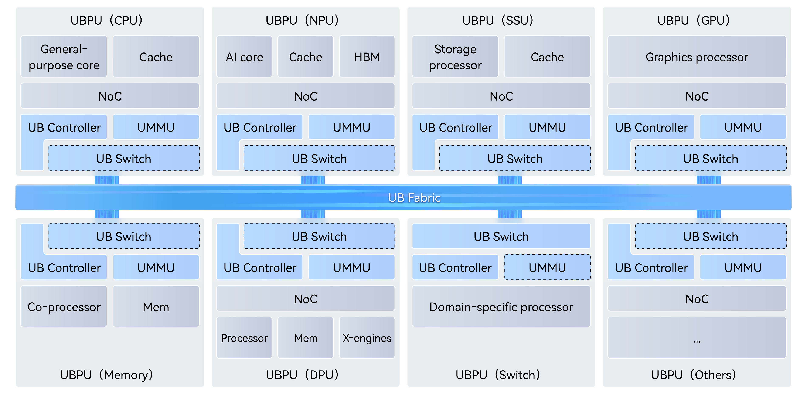

<h1 align="center">ns-3-UB</h1>

<h3 align="center">UnifiedBus Network Simulation Framework</h3>

<p align="center">
  <a href="https://gitcode.com/open-usim/ns-3-ub">GitCode</a> |
  <a href="QUICK_START_en.md">Quick Start</a> |
  <a href="scratch/README.md">Case Guide</a> |
  <a href="RELEASE_NOTES_UB_en.md#release-130">Release Notes</a> |
  <a href="README.md">中文</a>
</p>

<p align="center">
  <a href="https://gitcode.com/open-usim/ns-3-ub"></a>
  <a href="https://www.unifiedbus.com"></a>
  <a href="RELEASE_NOTES_UB_en.md#release-130"></a>
  <a href="LICENSE"></a>
</p>

<p align="center">
  <a href="src/unified-bus"></a>
  <a href="scratch/ns-3-ub-tools"></a>
  <a href="https://www.nsnam.org/releases/ns-3-44/"></a>
  <a href="CMakeLists.txt"></a>
  <a href="UNISON_README.md"></a>
</p>

<p align="center">
  <strong>Release 1.3.0</strong> · July 2026<br>
  RTP reliable transport · MPI/MTP Traffic DAG · Route compression · Engine performance<br>
  <a href="RELEASE_NOTES_UB_en.md#release-130">Full release notes →</a>
</p>

**Quick Start**: [QUICK_START_en.md](QUICK_START_en.md)

**Case Entry**: [scratch/README.md](scratch/README.md)

## Project Overview

`ns-3-UB` is an ns-3 simulation module based on the [UnifiedBus (UB) Base Specification](https://www.unifiedbus.com/zh). It implements the protocol stack including the function, transaction, transport, network, and data link layers defined in the specification, and can be used for protocol research, network architecture exploration, and simulation of congestion control, flow control, load balancing, and routing algorithms.

> **Note**: The English version of the UB specification is currently in "Coming Soon" status. Every effort has been made to align with the UB Base Specification, but differences may still exist. Please refer to the UB Base Specification as the authoritative guide.

`ns-3-UB` can be used to study:
- Topology designs targeting traffic affinity, low cost, and high reliability.
- Collective communication operators and traffic engineering algorithms.
- Transaction layer ordering and reliability in bus-coherent memory transaction networks.
- Memory-semantic transport in SuperPoD networks.
- Adaptive routing, load balancing, congestion control, and QoS optimization.


> This project provides pluggable "reference implementations" for policies/algorithms not specified in the UB Base Specification (such as switch modeling, route selection, congestion marking, buffering, and arbitration, etc.). These reference implementations are not part of the UB Base Specification and serve solely as examples and baselines; users may replace or disable them as needed.
>
> Functions not implemented in this project include, but are not limited to: detailed modeling for hardware internals, physical layer, performance parameters, control plane behavior (such as initialization behavior, error and exception event handling, etc.), memory management, security policies, etc.

The **typical simulation functionalities** supported by this project are shown in the following table.

<table>
  <thead>
    <tr>
      <th align="center">Layer</th>
      <th align="center">Capability Category</th>
      <th align="left">Supported Features</th>
      <th align="left">Incomplete / User-Customizable Features</th>
    </tr>
  </thead>
  <tbody>
    <tr>
      <td align="center" rowspan="2">Function Layer</td>
      <td>Functions</td>
      <td>Load/Store interface, URMA interface</td>
      <td>URPC, Entity-related advanced features</td>
    </tr>
    <tr>
      <td>Jetty</td>
      <td>Jetty, many-to-many / one-to-one communication models</td>
      <td>Jetty Group, Jetty state machine</td>
    </tr>
    <tr>
      <td align="center" rowspan="3">Transaction Layer</td>
      <td>Service Modes</td>
      <td>ROI, ROL, UNO</td>
      <td>ROT</td>
    </tr>
    <tr>
      <td>Transaction Ordering</td>
      <td>NO / RO / SO</td>
      <td>—</td>
    </tr>
    <tr>
      <td>Transaction Types</td>
      <td>Write, Read, Send</td>
      <td>Atomic, Write_with_notify, etc.</td>
    </tr>
    <tr>
      <td align="center" rowspan="4">Transport Layer</td>
      <td>Service Modes</td>
      <td>RTP</td>
      <td>UTP, CTP</td>
    </tr>
    <tr>
      <td>Reliability</td>
      <td>PSN, timeout retransmission, Go-Back-N, selective retransmission, fast selective retransmission</td>
      <td>Additional user-defined reliable transport strategies</td>
    </tr>
    <tr>
      <td>Congestion Control</td>
      <td>RTP congestion control mechanism, CAQM, DCQCN</td>
      <td>LDCP, CTP congestion control mechanism</td>
    </tr>
    <tr>
      <td>Load Balancing</td>
      <td>RTP load balancing: TPG mechanism, per-TP / per-packet load balancing, out-of-order reception</td>
      <td>CTP load balancing</td>
    </tr>
    <tr>
      <td align="center" rowspan="5">Network Layer</td>
      <td>Packet Format</td>
      <td>Support for IPv4 address format-based headers, 16-bit CNA address format-based headers</td>
      <td>Other header formats</td>
    </tr>
    <tr>
      <td>Address Management</td>
      <td>CNA to IP address translation, Primary / Port CNA</td>
      <td>User-customizable address allocation and translation strategies</td>
    </tr>
    <tr>
      <td>Routing</td>
      <td>Basic routing strategy based on destination address + header RT field, routing strategy based on path Cost, Hash-based ECMP, per-flow / per-packet Hash based on load balancing factors, load-aware adaptive routing</td>
      <td>User-customizable routing strategies</td>
    </tr>
    <tr>
      <td>Quality of Service</td>
      <td>SL-VL mapping, SP/DWRR-based inter-VL scheduling</td>
      <td>User-customizable inter-VL scheduling strategies</td>
    </tr>
    <tr>
      <td>Congestion Notification</td>
      <td>CAQM marking mode based on header CC field, DCQCN FECN marking mode</td>
      <td>FECN_RTT marking mode</td>
    </tr>
    <tr>
      <td align="center" rowspan="3">Data Link Layer</td>
      <td>Packet Transmission</td>
      <td>Packet-level modeling</td>
      <td>Cell / Flit level modeling</td>
    </tr>
    <tr>
      <td>Virtual Channels</td>
      <td>Point-to-point links support up to 16 VLs, SP/DWRR-based inter-VL scheduling</td>
      <td>User-customizable inter-VL scheduling strategies</td>
    </tr>
    <tr>
      <td>Credit Flow Control</td>
      <td>CBFC (exclusive / shared-credit), PFC (fixed / dynamic thresholds)</td>
      <td>Control plane credit initialization behavior, user-customizable credit sharing policies</td>
    </tr>
  </tbody>
</table>

## Project Architecture

```
├── README.md                   # Project documentation
├── scratch/                    # Simulation examples and test cases
│   ├── ub-quick-example.cc     # Main simulation program
│   ├── 2nodes*/             	# simple 2-node topology test cases
│   ├── clos*/                  # CLOS topology test cases
│   └── 2dfm4x4*/               # 2D FullMesh 4x4 test case set
│
└── src/unified-bus/            # UB Base Specification-based simulation components
    ├── model/                  
    │   ├── protocol/
    │   │   └── ub-*            # Protocol stack related modeling components
    │   └── ub-*                # Network element and algorithm components
    ├── test/                   # Unit tests
    └── doc/                    # Documentation and diagrams
```

## Key Components

### 1. UnifiedBus (UB) Module

The UB module is a simulation component implemented based on the UB Base Specification:

#### Modeling Components for Network Elements
<p align="center">

<br>
<em>UB Domain system architecture diagram.</em><em> Source: www.unifiedbus.com</em><br>
</p>

- **UB Controller** (`ub-controller.*`) - Key component for executing the UB protocol stack, providing user interfaces
- **UB Switch** (`ub-switch.*`) - Used for data forwarding between UB ports
- **UB Port** (`ub-port.*`) - Port abstraction, handling packet input and output
- **UB Link** (`ub-link.*`) - Point-to-point connections between nodes

#### Protocol Stack Components
- **Programming Interface Instances** (`ub-ldst-instance*`, `ub-ldst-thread*`, `ub-ldst-api*`) - Load/Store programming interface instances, interfacing with the programming models defined in the function layer
- **UB Function** (`ub-function.*`) - Function layer protocol framework implementation, supporting Load/Store and URMA programming models
- **UB Transaction** (`ub-transaction.*`) - Transaction layer protocol framework implementation
- **UB Transport** (`ub-transport.*`) - Transport layer protocol framework implementation
- **UB Network** (composed of `ub-routing-table.*`, `ub-congestion-control.*`, `ub-switch.*` functionalities) - Network layer protocol framework implementation
- **UB Datalink** (`ub-datalink.*`) - Data link layer protocol framework implementation

#### Network Algorithm Components
- **Traffic Injection Component** (`ub-traffic-gen.*`) - Reads user traffic configuration and injects traffic for simulation nodes according to specified serial and parallel relationships
- **TP Connection Manager** (`ub-tp-connection-manager.h`) - TP Channel manager, facilitating user's lookup of TP Channel information for each node
- **Switch Allocator** (`ub-allocator.*`) - Modelling the whole process of output port lookup for packets in a switch
- **Queue Manager** (`ub-queue-manager.*`) - Buffer management module, affecting load balancing, flow control, queuing, packet dropping, and other behaviors
- **Routing Process** (`ub-routing-process.*`) - Routing module, implementing routing table management and query functionality
- **Congestion Control** (`ub-congestion-control.*`) - Framework module for congestion control algorithms
- **Congestion Control Algorithms** (`ub-caqm.*`, `ub-dcqcn.*`) - C-AQM and DCQCN congestion control algorithm implementations
- **Flow Control** (`ub-flow-control.*`) - Flow control framework module
- **Fault Injection Module** (`ub-fault.*`) - Applies fault-related parameters (e.g., packet loss rate, high latency, congestion levels, packet errors, transient disconnections, lane reduction) to specific traffic flows

#### Data Types and Tools
- **Datatype** (`ub-datatype.*`) - UB data type definitions
- **Header** (`ub-header.*`) - UB protocol header definition and parsing
- **Network Address** (`ub-network-address.h`) - Network address related utility functions, including address translation, mask matching and other functionalities

### 2. Core Simulation Features

#### Topology and Traffic Support
- **Arbitrary Topology**: Supports simulation and modeling of arbitrary topologies. Users can quickly build topologies and routing tables using UB toolsets
- **Arbitrary Traffic**: Supports configuration of arbitrary simulation traffic. Users can quickly build collective communications and communication operator graphs using UB toolsets in conjunction with UbClientDag
- **Performance Monitoring**: Comprehensive performance metric collection and analysis

#### Protocol Stack Modeling
- **UB Protocol Stack**: Supports protocol stack modeling across the data link, network, transport, transaction, and function layers
- **Memory Semantics**: Implements Load/Store-based memory semantic behavior modeling
- **Message Semantics**: Implements URMA-based message semantic behavior modeling
- **Native Multipathing**: Implements native multipath support through TP/TP Group protocol mechanisms

#### Protocol Algorithm Support
- **Flow Control**: Implements credit-based flow control (CBFC exclusive / shared-credit) and priority-based flow control (PFC fixed / dynamic thresholds)
- **Congestion Control**: Implements the framework of the well-known congestion control loop, including network-side marking, receiver response, sender response, and congestion control algorithms; supports C-AQM and DCQCN
- **Routing Policies**: Supports shortest-path routing and bypass strategies; supports packet spraying, ECMP, and other load balancing mechanisms
- **QoS Support**: Provides end-to-end QoS support, currently supporting SP and DWRR scheduling policies
- **Switch Arbitration**: Modular implementation of the UB Switch arbitration mechanism, currently supporting SP and DWRR scheduling

### 3. Script Toolset

Provides the complete network simulation workflow to support:

- **Network Topology Generation**: Automatically generates various network topologies (CLOS, 2D FullMesh, etc.)
- **Traffic Pattern Generation**: Supports All-Reduce, All-to-All, All-to-All-V, and other communication patterns; supports multiple collective communication algorithms like RHD, NHR, and OneShot
- **Performance Analysis Tools**: Throughput calculation, latency analysis, CDF plotting
- **Formatted Result Output**: Automatically generates basic result information tables for flow completion time, bandwidth, etc., with optional generation of packet-level, hop-by-hop information within the network

### 4. OpenUSim Skills (Repository-Bundled)

This repository includes OpenUSim skills under `.codex/skills/` for planning, running, and reviewing `ns-3-ub` simulations.

They cover smoke runs, old-case reproduction, one-off debugging, A/B comparisons, parameter sweeps, and controlled-variable studies. For comparisons, the plan records the baseline, compared configurations, fixed controls, prediction, and evidence source before cases are generated.

Included skills:

- `openusim-welcome`: checks whether the current worktree, build outputs, and toolchain are usable
- `openusim-plan-experiment`: turns a natural-language goal into a runnable simulation plan
- `openusim-run-experiment`: generates cases, completes configuration, runs simulations, and records explicit runtime errors
- `openusim-analyze-results`: interprets outputs, investigates failures, compares expected and observed results, and suggests the next run
- `openusim-capture-insights`: with user approval, writes confirmed root causes or reusable judgments as knowledge cards

These skills depend on this repository and the `ns-3-ub-tools` submodule, so they are maintained in-tree.

## License

This project follows the ns-3 license agreement, GPL v2. See the `LICENSE` file for details.

## Citation
```bibtex
@software{UBNetworkSimulator,
  month = {10},
  title = {{ns-3-UB: UnifiedBus Network Simulation Framework}},
  url = {https://gitcode.com/open-usim/ns-3-ub},
  version = {1.3.0},
  year = {2026}
}
```
